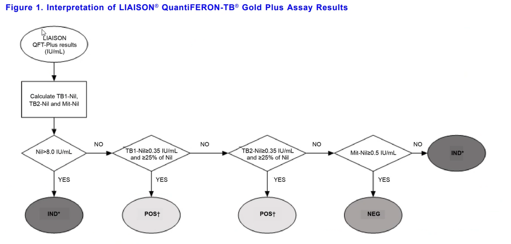
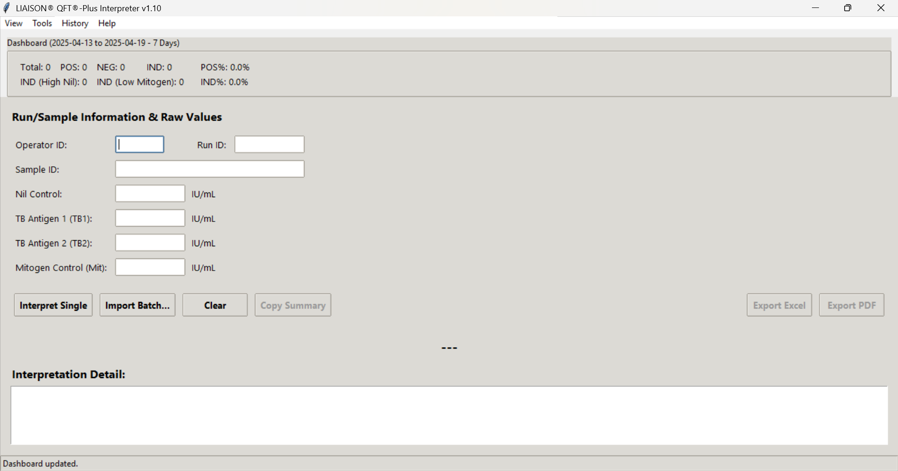

# LIAISON® QFT®-Plus Interpreter - v1.10

## Flowchart



# Preview



**A desktop application designed for laboratory professionals to assist in the interpretation of DiaSorin LIAISON® QuantiFERON-TB® Gold Plus assay results based on the manufacturer's algorithm.**

**Disclaimer:** *This tool is intended to aid interpretation based on the defined algorithm (refer to the flowchart via Help > View Flowchart). Results should always be interpreted by qualified personnel in the context of all available clinical information, patient risk factors, and other diagnostic findings. This tool does not replace professional medical or laboratory judgment. For Research Use Only or Laboratory Use where applicable, based on local regulations.*

---

## Features

*   **Accurate Interpretation:** Implements the standard result interpretation flowchart (Nil control check, TB1/TB2 antigen checks with absolute and relative cutoffs, Mitogen control check).
*   **Clear Results:** Displays the final interpretation (POS†, NEG, IND\*) prominently, along with the reason and calculated intermediate values (Antigen-Nil, Mitogen-Nil).
*   **Single & Batch Processing:**
    *   Interpret results for individual samples via manual input.
    *   Import and process multiple samples from CSV or Excel (.xlsx) files using the "Import Batch..." feature (requires specific header format - see Help > Batch Import Format...).
*   **Data Persistence:**
    *   **History Database:** Automatically saves every interpretation (timestamp, Operator ID, Run ID, Sample ID, inputs, result, reason) to a local SQLite database (`qft_history.db`) for traceability.
    *   **CSV Log:** Appends interpretation details to a structured CSV log file (`qft_interpreter_log.csv`).
*   **History & Log Viewer:** Built-in viewers accessible from the menu to browse, search, and filter past interpretations (by Sample ID, Run ID, Date).
*   **Traceability:** Includes fields for optional Operator ID and Run ID, which are stored and included in exports.
*   **Quality Assurance:**
    *   **Delta Checks:** Automatically compares current interpretation against the most recent result for the same Sample ID in the history database and warns of significant changes.
    *   **Plausibility Warnings:** Provides non-blocking warnings for potentially unusual input values (e.g., high Nil within range, very high Mitogen).
    *   **Self-Test Routine:** Includes a built-in validation check (Tools > Run Self-Test...) using predefined test cases to verify the core interpretation logic.
*   **Export Options:**
    *   Export individual results or full batch results to professionally formatted PDF or Excel (.xlsx) reports.
    *   "Copy Summary" button copies the detailed interpretation text to the clipboard.
*   **User Experience:**
    *   Intuitive Graphical User Interface (GUI).
    *   Theme selection (View > Theme).
    *   Persistent window size and position (saved in `qft_config.json`).
    *   Basic barcode scanner simulation support (rapid key entry + Enter in ID fields).
    *   Worklist manager for managing sample queues within a session.
    *   Status bar providing feedback on application state.
    *   Integrated help for batch format and flowchart viewing.

## Requirements

*   **Python:** Version 3.7 or higher recommended.
*   **Required Libraries:** Install using pip:
    ```bash
    pip install Pillow openpyxl reportlab
    ```
    *   `Pillow`: For displaying the flowchart image.
    *   `openpyxl`: For reading/writing Excel (.xlsx) files (Batch Import/Export, Summary Reports).
    *   `reportlab`: For generating PDF reports (Export, Summary Reports).
*   **Operating System:** Tested primarily on Windows, but should be compatible with macOS and Linux (some theme appearances may vary).

## Installation / Setup

1.  **Clone or Download:**
    *   **Git:** `git clone https://github.com/YourUsername/QFT-Interpreter-App.git` (Replace with your actual repository URL)
    *   **Download:** Download the ZIP file from the GitHub repository page and extract it.
2.  **Navigate:** Open a terminal or command prompt and change directory into the project folder:
    ```bash
    cd path/to/QFT-Interpreter-App
    ```
3.  **Install Dependencies:**
    ```bash
    pip install -r requirements.txt
    ```
    *(**Note:** You'll need to create a `requirements.txt` file first - see below)*

## Creating `requirements.txt` (Recommended)

In your project directory, create a file named `requirements.txt` with the following content:

```text
Pillow>=9.0.0 # Example version, adjust if needed
openpyxl>=3.0.0
reportlab>=3.6.0
```

## Usage

1.  **Run the Script:**
    ```bash
    python qft_interpreter.py
    ```
    *(Replace `qft_interpreter.py` with the actual name of your main script file)*

2.  **Enter Data:** Fill in the Operator ID (optional), Run ID (optional), Sample ID (required), Nil, TB1, TB2, and Mitogen values.

3.  **Interpret:**
    *   Click "Interpret Single" or press Enter after typing the Mitogen value.
    *   Alternatively, use "Import Batch..." to process a CSV/Excel file (follow format guidelines shown in `Help > Batch Import Format...`).

4.  **Review Results:** View the interpretation in the main window.

5.  **Use Tools/History:** Access features like History, Log Viewer, Worklist, Reports, and Self-Test via the menu bar.

6.  **Export:** Use the export buttons or report generator as needed.

## File Structure

*   `qft_interpreter.py`: The main application script.
*   `qft_flowchart.png`: Image file used for the flowchart viewer.
*   `.gitignore`: Specifies files for Git to ignore.
*   `README.md`: This file.
*   `qft_history.db` *(Generated)*: SQLite database storing interpretation history.
*   `qft_interpreter_log.csv` *(Generated)*: CSV log file for interpretations.
*   `qft_config.json` *(Generated)*: Stores user preferences like window size and theme.
*   `requirements.txt` *(Recommended)*: Lists Python dependencies.